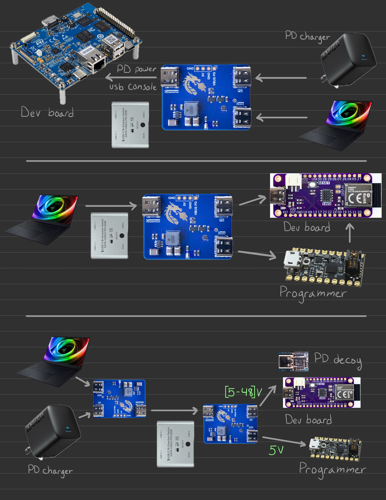
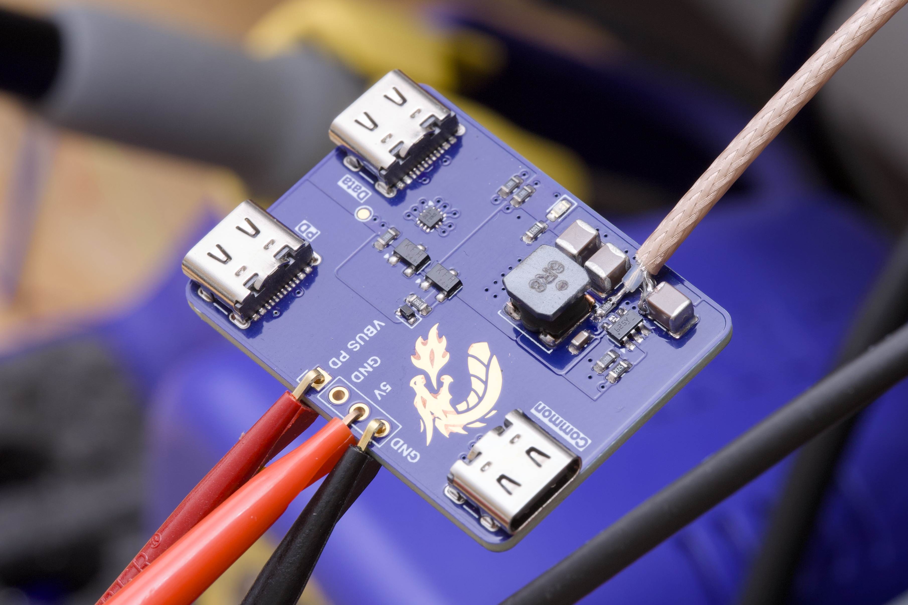
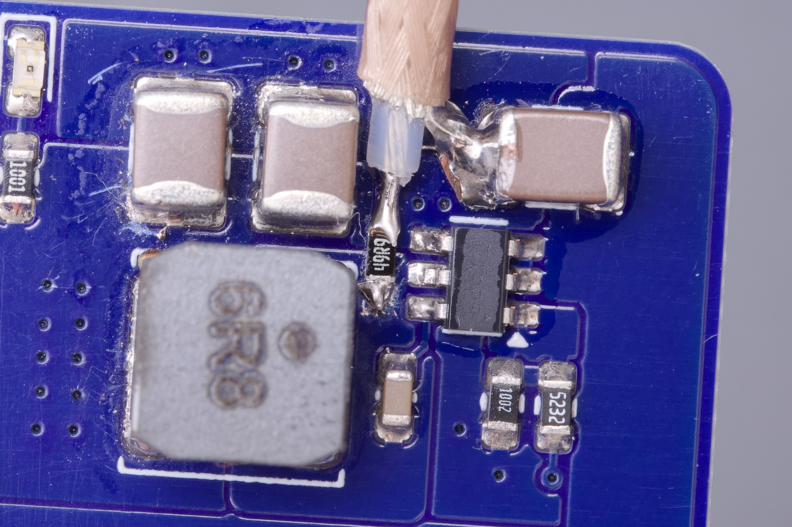

# USB-C mux/demux

## Use-cases

Basically used to mux or demux usb 2.0 data bus with USB-PD up to and including
revision 3.1 at 48V.

Here's an illustration highlighting a couple use-cases:

## Switching converter analysis

50 ohms series termination at the SW node.

### Switch node

| Input Voltage | Waveform | Rising edge |
|---------------|----------|-------------|
| 10V           |  |  |
| 20V           |  |  |
| 48V           |  |  |

### Output

| Input Voltage | No Load | 50 mA | 500 mA | 1 A |
|---------------|---------|-------|--------|-----|
| 10V           |  |  |  | 
| 20V           |  |  |  | 
| 48V           |  |  |  | 
